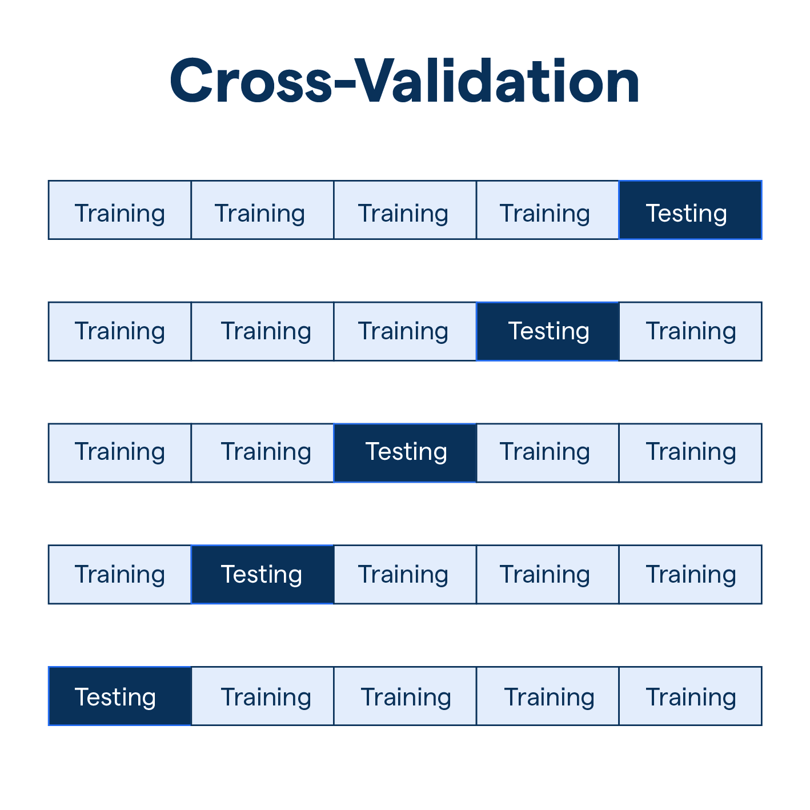

# LinearRegression modelni o'qitish

**LinearRegression** - bu supervised machine learning algoritimi bo'lib bu model o'sib boruvchi qiymatlarga asoslangan holda natijani bashorat qiladi.

```python
from sklearn.linear_model import LinearRegression

lr_model = LinearRegression()
```

Hozirda `lr_model` o'zgaruvchisida o'qitilmagan `LinerRegression` model mavjud.

Bizning keyingi qadamimiz bu modelni o'qitishdan iborat.

```python
lr_model.fit(X_train)
```

Shu bir qator bilan biz modelimizni o'qitishni yakunlaymiz.

O'qitilgan modeldan bashorat qilingan ma'lumotlarni olish uchun esa biz `.predict` metodini ishlatishimiz mumkin.

```python
predicted_y_test = lr_model.predict(X_test)
```

# Random Forest modelini o'qitish

**RandomForest** - bu supervised machine learning algoritmi bo'lib.
U bilan biz Classification va Regression muammolarini yechishimiz mumkin.

```python
from sklearn.ensemble import RandomForestRegressor

rf_model = RandomForestRegressor()

rf_model.fit(X_train)
```

Bu modelni o'qitish `LinearRegression` modelini o'qitish bilan bir xil.

Ushbu model bilan bashorat qilish uchun `.predict()` metodidan foydalanamiz.

# Modelni baholash

Modellarni baholash uchun bizda "MAE" yoki "RMSE" baholash mezonlari mavjud.

- MAE - Mean Absolute Error (O'rtacha xatolik)
- RMSE - Root Mean Square Error (O'rtacha kvadrat xatolik)


## MAE

O'rtacha xatolikni hisoblash

```python
from sklearn.metrics import mean_absolute_error

mae = mean_absolute_error(actual_y_test, predicted_y_test)
```

## RMSE

O'rtacha kvadrat xatolikni hisoblash

```python
from sklearn.metrics import mean_square_error

rmse = mean_square_error(actual_y_test, predicted_y_test)

rmse = np.sqrt(rmse)
```

# Cross Validation

**Cross-Validation** - bu mashinani o‘rganish jarayonida modelning ishlashini va umumlashtirish qobiliyatini baholash uchun ishlatiladigan usul.

Bu usul ma’lumotlarni bir necha qismga, ya'ni "fold"larga bo‘lish orqali amalga oshiriladi.

Keyin model shu foldlar kombinatsiyasida turlicha bo‘linadi va natijada ularning ishlash darajasi aniqroq baholanadi.



## Using

Bu usuldan **scikit-learn**da foydalanish uchun bizda `sklearn.model_selection` moduli mavjud.

```python
from sklearn.model_selection import cross_val_score

scores = cross_val_score(lr_model, X, y, cv=5)

print("Kross-validatsiya baholari:", scores)
print("O‘rtacha baho:", scores.mean())
```

Masalan, 5 foldli kross-validatsiyada:

- Ma’lumotlar 5 teng qismga bo‘linadi.
- Model 4 qismda o‘qitilib, 5-qismda test qilinadi.
- Bu jarayon 5 marta takrorlanadi, har safar yangi qism test to‘plami sifatida olinadi va qolgan qisimlar o‘qitish uchun ishlatiladi.

# Modelni saqlash

Bizda yaratilgan va mashq qildirilgan modellarni saqlash uchun ikkita usul mavjud:

- pickle
- joblib

## Pickle

### Saqlash

```python
import pickle

with open('model.pkl', 'wb') as file:
    pickle.dump(lr_model, file)
```

### O'qish

```python
import pickle

with open('model.pkl', 'rb') as file:
    model = pickle.load(file)


print(type(model)) #sklearn.linear_model._base.LinearRegression
```

## Joblib

### Saqlash

```python
import joblib

joblib.dump(lr_model, 'model.jbl')
```

### O'qish

```python
import joblib

model = joblib.load('model.jbl')

print(type(model)) #sklearn.linear_model._base.LinearRegression
```
