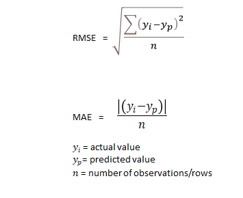

# LinearRegression modelni o'qitish

**LinearRegression** - bu supervised machine learning algoritimi bo'lib bu model o'sib boruvchi qiymatlarga asoslangan holda natijani bashorat qiladi.

```python
from sklearn.linear_model import LinearRegression

lr_model = LinearRegression()
```

Hozirda `lr_model` o'zgaruvchisida o'qitilmagan `LinerRegression` model mavjud.

Bizning keyingi qadamimiz bu modelni o'qitishdan iborat.

```python
lr_model.fit(X_train)
```

Shu bir qator bilan biz modelimizni o'qitishni yakunlaymiz.

O'qitilgan modeldan bashorat qilingan ma'lumotlarni olish uchun esa biz `.predict` metodini ishlatishimiz mumkin.

```python
predicted_y_test = lr_model.predict(X_test)
```

# Modelni baholash

Modellarni baholash uchun bizda "MAE" yoki "RMSE" baholash mezonlari mavjud.

- MAE - Mean Absolute Error (O'rtacha xatolik)
- RMSE - Root Mean Square Error (O'rtacha kvadrat xatolik)



## MAE

O'rtacha xatolikni hisoblash

```python
from sklearn.metrics import mean_absolute_error

mae = mean_absolute_error(actual_y_test, predicted_y_test)
```

## RMSE

O'rtacha kvadrat xatolikni hisoblash

```python
from sklearn.metrics import mean_square_error

rmse = mean_square_error(actual_y_test, predicted_y_test)

rmse = np.sqrt(rmse)
```
