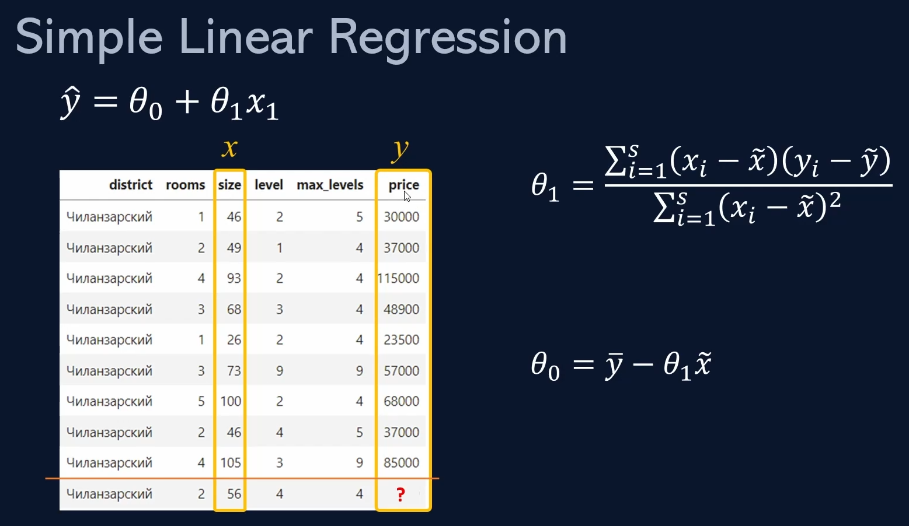

# Simple Linear Regression (oddiy chiziqli regressiya)

**Simple Linear Regression** (oddiy chiziqli regressiya) modeli faqat ikkita asosiy o'zgaruvchi, ya'ni kirish (x) va chiqish (y) o'zgaruvchilari asosida ishlaydi.

## Modelning ishlashi

Model asosiy g'oyasi - kirish o'zgaruvchisi (masalan, yoshi, tajribasi yoki boshqa biror parametr) va natija (masalan, ish haqi, uy narxi yoki boshqa biror ko'rsatkich) orasidagi chiziqli bog'lanishni topish va shunga asoslangan bashorat qilish.

