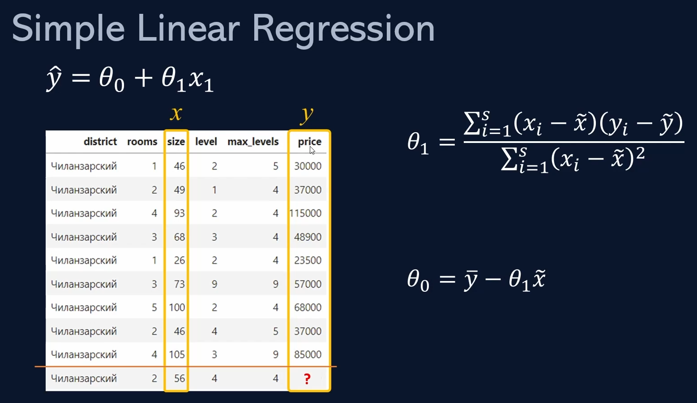

# Simple Linear Regression (oddiy chiziqli regressiya)

**Simple Linear Regression** (oddiy chiziqli regressiya) modeli faqat ikkita asosiy o'zgaruvchi, ya'ni kirish (x) va chiqish (y) o'zgaruvchilari asosida ishlaydi.


## Modelning ishlashi

Model asosiy g'oyasi - kirish o'zgaruvchisi (masalan, yoshi, tajribasi yoki boshqa biror parametr) va natija (masalan, ish haqi, uy narxi yoki boshqa biror ko'rsatkich) orasidagi chiziqli bog'lanishni topish va shunga asoslangan bashorat qilish.



# Task

## 1-Vazifa

Sizning vazifangiz yuqoridagi `X` va `y` o'zgaruvchilardan quyidagi formuladan foydalangan xolda $\theta_0$ va $\theta_1$ koeffisientlarni hisoblash.


Bu yerda $\tilde{x}$ - `X` ustun uchun o'rtracha qiymat, $\tilde{y}$ - `y` ustun uchun o'rtracha qiymat

```python
temp = pd.DataFrame({'x': X, 'y': y})

temp['x_without_mean'] = temp['x'] - X.mean()
temp['y_without_mean'] = temp['y'] - y.mean()

temp['x*y'] = temp['x_without_mean'] \* temp['y_without_mean']

temp['x_without_mean_square'] = temp['x_without_mean'] \*\* 2

o1 = temp['x*y'].sum() / temp['x_without_mean_square'].sum()
o1
```

740.0264822713249

```python
o0 = y.mean() - o1 * X.mean()
o0
```

-195.94911352666531

## 2-Vazifa

`X` dan bir nechta tasodifiy qiymatlarni ajratib oling va ularga mos keluvchi `y` ni yuqoridagi koeffisientlar yordamida hisoblab ko'ring.


```python
X_test = X.sample(10)
y_test = y.loc[X_test.index]

labels = o0 + o1 * X_test

labels
```

`index` `value`\
6366 53085.957610\
5497 53085.957610\
1815 37545.401482\
888 53085.957610\
5296 49385.825199\
6292 94527.440617\
5155 67886.487255\
2927 33105.242589\
989 35325.322035\
2586 42725.586858\
Name: size, dtype: float64

## 3-Vazifa

Hisoblangan va asl qiymtlar o'rtasidagi RMSE (root mean square error), MAE (mean absolute error) hisoblang.


