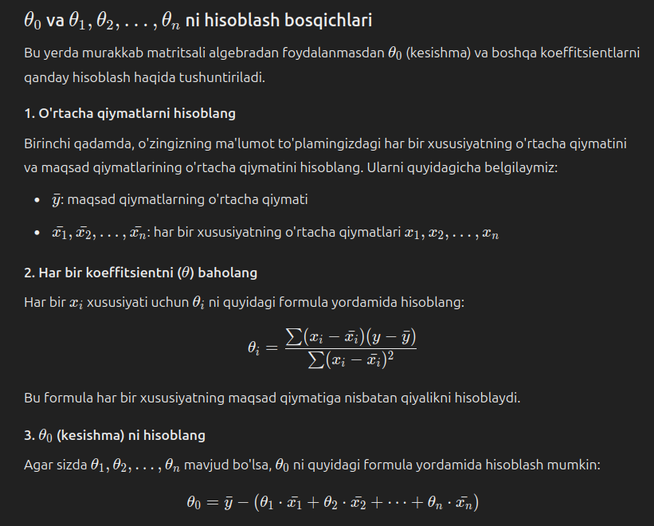

# Linear regression

Linear regression uchun teta (Theta) bir va teta (Theta) nol hisoblash uchun formula.

Hisoblangan tetalar va X yordamida predicted qiymatni topish uchun formula.

# Multiple linear regression

Multiple liner regression predicted qiymatlarni aniqlash uchun bizga yana Theta ($\theta$) kerak bo'ladi.

Theta bir, ikki, uchu .... N larni hisoblash uchun yuqoridagi formula to'g'ri keladi.

Lekin teta (Theta) nolni hisoblash uchun boshqa formuladan foydalanish kerak.

## Tushuntirish

1. Barcha ustunlar uchun o'rtacha qiymatlarni hisoblash.

   Y ustuni uchun o'rtacha qiymat $\bar{y}$\
   X ustunlari uchun o'rtacha qiymatlar $\bar{X}$

   Bizda bir nechta X ustunlari va bitta Y ustuni mavjud.
   Shuning uchun bizda bir nechta $\bar{X}_1$,$\bar{X}_2$, $\bar{X}_3$, $\bar{X}_4$ bo'ladi.

2. Har bir ustun uchun Theta ($\theta$) larni hisoblash.

   Buning uchun yuqoridagi formuladan foydalanish mumkun.

3. Bizda barcha $\theta_1$, $\theta_2$, $\theta_3$...$\theta_n$ va barcha $\bar{X}_1$,$\bar{X}_2$...$\bar{X}_n$, shu bilan birga bizda $\bar{y}$ bo'lishi kerak.

   $\theta_0$ = $\bar{y}$ - ($\theta_1$ _ $\bar{X_1}$ + $\theta_2$ _ $\bar{X_2}$ + ... + $\theta_n$ \* $\bar{X_n}$)

   Shu formular yordamida biz Theta nolni ($\theta_0$) hisoblab olishimiz mumkin.

4. Bizga kerakli bo'lgan predicted qiymatni topish.

   Biz predicted qiymatni $\hat{y}$ bilan belgilaymiz.

   $\hat{y}$ = $\theta_0$ + $\theta_1$ \* $X_1$ + $\theta_2$ \* $X_2$ + .... + $\theta_n$ \* $X_n$
