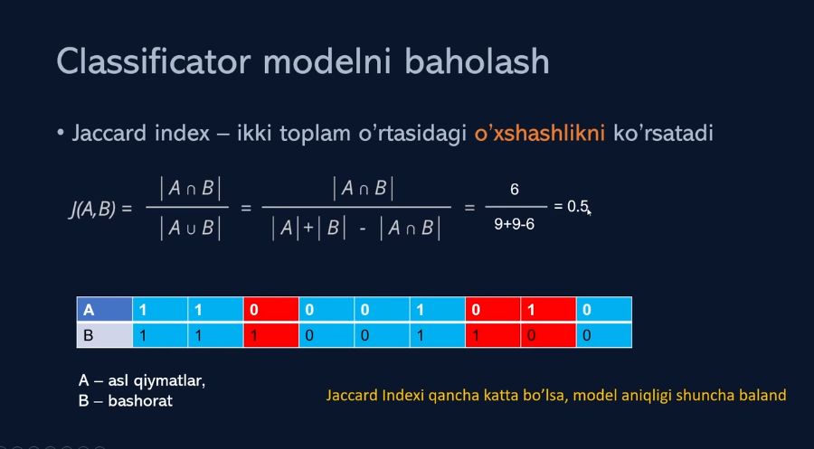
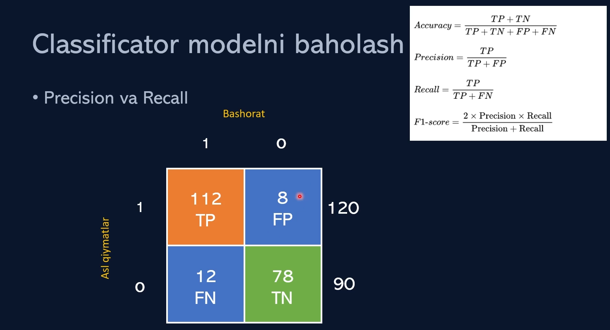

# How to calculate accuracy of classification model

We can calculate accuracy of classification model:

- Jaccard index

- Confusion matrix

## Jacard index

Qanday qilib biz jaccard indekisini `scikit-learn` yordamida hisoblashimiz mumkin.

```python
from sklearn.metrics import jaccard_score

score = jaccard_score(y_true, y_predict)
```



## Confusion matrix

Qanday qilib biz confusion matrixni `scikit-learn` yordamida hisoblashimiz mumkin.

```python
import seaborn as sns
import matplotlib.pyplot as plt
from sklearn.metrics import confusion_matrix

matrix = confusion_matrix(y_true, y_predict)

sns.heatmap(matrix, annot=True)
plt.show()
```



- TP = True Positive
- TN = True Negative
- FP = False Positive
- FN = False Negative

```python
from sklearn.metrics import precision_score, recall_score, f1_score, accuracy_score

precision = precision_score(y_true, y_predict)
recall = recall_score(y_true, y_predict)
f1 = f1_score(y_true, y_predict)
accuracy = accuracy_score(y_true, y_predict)
```

Bularning barchasini bitta funksiya bilan hisoblash mumkin:

```python
from sklearn.metrics import classification_report

report = classification_report(y_true, y_predict)
```
